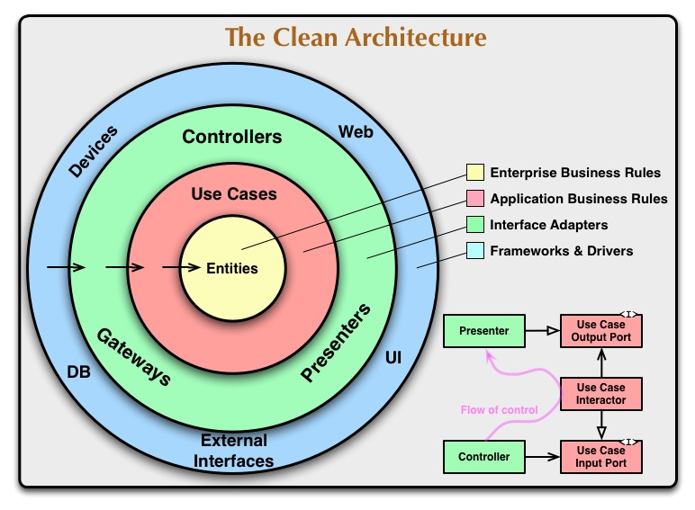

# 🛒 Product Catalog API

<div align="center">


**API RESTful para catálogo de produtos com foco em Clean Architecture e boas práticas de backend**

[Funcionalidades](#-funcionalidades) • [Arquitetura](#-arquitetura) • [Tecnologias](#-stack-tecnológico) • [Começando](#-começando) • [API](#-endpoints-da-api) • [Destaques Técnicos](#-destaques-técnicos)

</div>

---

## 📋 Sobre o Projeto

Este projeto é uma implementação de uma **API RESTful de catálogo de produtos** desenvolvida como estudo e demonstração de padrões de arquitetura e boas práticas de desenvolvimento backend. O foco principal está na aplicação de:

- **Clean Architecture** - Separação clara de responsabilidades entre camadas
- **Estratégias de Cache** - Implementação de cache inteligente com Caffeine
- **Tratamento de Erros** - Respostas padronizadas seguindo RFC 7807
- **Validação em Múltiplas Camadas** - Bean Validation + regras de domínio
- **Testes e Cobertura** - Suite de testes com 90%+ de cobertura

## ✨ Funcionalidades

- 📦 **CRUD completo de Produtos** - Criação, leitura, atualização e exclusão
- 🔍 **Busca detalhada** - Endpoint otimizado para página de detalhes
- 📖 **Swagger UI** - Documentação interativa e testes de API
- 📄 **Paginação** - Listagem paginada e ordenável
- ⚡ **Cache inteligente** - Caffeine cache com TTL e invalidação automática
- ✅ **Validação robusta** - Bean Validation + regras de negócio
- 🛡️ **Tratamento de erros** - Respostas padronizadas (RFC 7807)
- 📝 **Logs Estruturados** - Monitoramento via SLF4J/Lombok
- 📊 **Versionamento de API** - Suporte a múltiplas versões

---

## 🏗️ Arquitetura

O projeto foi desenvolvido seguindo os princípios da **Clean Architecture**, garantindo separação de responsabilidades e independência de frameworks.

<div >



</div>

### Estrutura de Camadas

```
src/main/java/com/aelcioputzel/productcatalog/
├── 📁 domain/                    # Camada de Domínio (Enterprise Business Rules)
│   ├── entity/                   # Entidades de negócio
│   │   ├── Product.java          # Agregado principal
│   │   ├── ProductVariant.java   # Variantes do produto
│   │   ├── ProductVariantValue.java
│   │   ├── Seller.java           # Vendedor
│   │   └── Condition.java        # Enum de condição (NOVO/USADO)
│   ├── exception/                # Exceções de domínio
│   └── util/                     # Utilitários de domínio
│
├── 📁 application/               # Camada de Aplicação (Application Business Rules)
│   ├── gateway/                  # Interfaces dos gateways (portas de saída)
│   │   ├── FindProductGateway.java
│   │   ├── SaveProductGateway.java
│   │   ├── DeleteProductGateway.java
│   │   └── FindSellerGateway.java
│   └── usecase/                  # Casos de uso
│       ├── CreateProductUseCase.java
│       ├── FindProductUseCase.java
│       ├── UpdateProductUseCase.java
│       ├── DeleteProductUsecase.java
│       └── FindSellerUseCase.java
│
└── 📁 infrastructure/            # Camada de Infraestrutura (Frameworks & Drivers)
    ├── config/                   # Configurações
    │   ├── CacheConfig.java      # Configuração do Caffeine Cache
    │   ├── ProductConfig.java    # Beans de produto
    │   └── SellerConfig.java     # Beans de vendedor
    ├── controller/               # REST Controllers
    │   ├── SaveProductController.java
    │   ├── FindProductController.java
    │   ├── UpdateProductController.java
    │   ├── DeleteProductController.java
    │   ├── dto/                  # Data Transfer Objects
    │   ├── mapper/               # MapStruct Mappers
    │   ├── exception/            # Global Exception Handler
    │   └── apiversion/           # Versionamento de API
    ├── gateway/                  # Implementações dos gateways
    └── persistence/              # Camada de persistência
        ├── entity/               # Entidades JPA
        └── repository/           # Spring Data Repositories
```

### Princípios Aplicados

| Princípio | Aplicação no Projeto |
|-----------|---------------------|
| **Dependency Rule** | Dependências sempre apontam para dentro (Domain não conhece Application, Application não conhece Infrastructure) |
| **SRP** | Cada classe tem uma única responsabilidade |
| **OCP** | Gateways permitem extensão sem modificação |
| **DIP** | Use Cases dependem de abstrações (Gateways), não de implementações |

---

## 🛠️ Stack Tecnológico

| Categoria | Tecnologia | Versão | Propósito |
|-----------|------------|--------|-----------|
| **Runtime** | Java | 21 | LTS com recursos modernos (Records, Pattern Matching) |
| **Framework** | Spring Boot | 3.2.5 | Framework principal |
| **Persistência** | Spring Data JPA | 3.2.5 | ORM e repositórios |
| **Banco de Dados** | H2 Database | 2.1.214 | Banco em memória |
| **Cache** | Caffeine | Latest | Cache de alta performance |
| **Validação** | Hibernate Validator | 8.0.0 | Bean Validation |
| **Mapeamento** | MapStruct | 1.5.5 | Conversão de DTOs |
| **Utilitários** | Lombok | 1.18.30 | Redução de boilerplate |

---

## 📖 Documentação Interativa (Swagger)

A API conta com documentação interativa via **Swagger/OpenAPI**, permitindo explorar e testar todos os endpoints diretamente pelo navegador.

- **Swagger UI**: `http://localhost:8080/swagger-ui/index.html`
- **OpenAPI Spec**: `http://localhost:8080/v3/api-docs`

---

## 🚀 Começando - Como Rodar a Aplicação

### Pré-requisitos

- **Java 21** ou superior
- **Maven 3.8+**

### Instalação e Execução

```bash

# Compile o projeto
mvn clean install

# Execute a aplicação
mvn spring-boot:run
```
A API estará disponível em: `http://localhost:8080`

### Rodando Testes e Cobertura

```bash
# Executar todos os testes
mvn clean install
mvn test

# Gerar relatório de cobertura (JaCoCo)
mvn jacoco:report
```

O relatório detalhado de cobertura poderá ser encontrado em: `target/site/jacoco/index.html`

### 🐳 Rodando com Docker

Você pode compilar a imagem e rodar o container diretamente sem precisar do JDK configurado localmente:

```bash
# 1. Fazer o Build da imagem localmente
docker build -t product-catalog-api:latest .

# 2. Subir o container localmente na porta 8080
docker run -d -p 8080:8080 --name catalog-api product-catalog-api:latest
```

### ☸️ Rodando no Kubernetes (K8s)

O projeto exporta manifestos prontos para orquestração de containers. Com um cluster local ativo (Docker Desktop ou Minikube):

```bash
# 1. Aplicar todos os manifestos de uma vez (Namespace, ConfigMap, Service, Deployment, HPA e Ingress)
kubectl apply -f ./k8s/

# 2. Adicione no arquivo "hosts" da sua máquina (C:\Windows\System32\drivers\etc\hosts ou /etc/hosts):
127.0.0.1       meu-catalogo.local
```
Após executar os comandos acima, a API responderá através do Ingress Router no link: `http://meu-catalogo.local/swagger-ui/index.html`

Para destruir todos os recursos: `kubectl delete -f ./k8s/`


### Console H2

Para visualizar o banco de dados em memória:
- **URL**: http://localhost:8080/h2-console
- **JDBC URL**: `jdbc:h2:mem:testdb`
- **Username**: `sa`
- **Password**: `password`

---

## 📡 Endpoints da API

### Base URL: `/api/v1`

| Método | Endpoint | Descrição |
|--------|----------|-----------|
| `POST` | `/products` | Criar novo produto |
| `GET` | `/products` | Listar produtos (paginado) |
| `GET` | `/products/{id}` | Obter detalhes do produto |
| `PUT` | `/products/{id}` | Atualizar produto |
| `DELETE` | `/products/{id}` | Remover produto |

### Exemplos de Requisições

#### 📝 Criar Produto

```http
POST /api/v1/products
Content-Type: application/json

{
  "sellerId": 1,
  "name": "iPhone 15 Pro Max",
  "description": "Smartphone Apple com chip A17 Pro, câmera de 48MP e acabamento em titânio",
  "price": 9999.99,
  "availableQuantity": 50,
  "condition": "NEW",
  "category": "Electronics",
  "variants": [
    {
      "type": "Cor",
      "values": [
        { "value": "Titânio Natural" },
        { "value": "Titânio Azul" },
        { "value": "Titânio Branco" }
      ]
    },
    {
      "type": "Armazenamento",
      "values": [
        { "value": "256GB" },
        { "value": "512GB" },
        { "value": "1TB" }
      ]
    }
  ]
}
```

#### 📋 Listar Produtos (Paginado)

```http
GET v1/products?page=0&size=10&sort=name,asc
```

#### 🔍 Detalhes do Produto

```http
GET v1/products/1
```

**Response:**
```json
{
  "id": 1,
  "name": "iPhone 15 Pro Max",
  "description": "Smartphone Apple com chip A17 Pro...",
  "price": 9999.99,
  "availableQuantity": 50,
  "condition": "NEW",
  "category": "Electronics",
  "variants": [...],
  "seller": {
    "id": 1,
    "name": "TechStore Official"
  }
}
```

---

## 🌟 Destaques Técnicos

### ⚡ Sistema de Cache Inteligente

Implementação de cache em dois níveis usando **Spring Cache** com **Caffeine**:

```java
@Configuration
@EnableCaching
public class CacheConfig {
    @Bean
    public CacheManager cacheManager() {
        CaffeineCacheManager cacheManager = new CaffeineCacheManager("products", "productDetails");
        cacheManager.setCaffeine(Caffeine.newBuilder()
                .expireAfterWrite(Duration.ofMinutes(10))  // TTL de 10 minutos
                .maximumSize(1000)                          // Limite de 1000 entradas
                .recordStats());                            // Métricas habilitadas
        return cacheManager;
    }
}
```

**Estratégias de invalidação:**
- ✅ **Listagem** (`products`) - Cache com chave baseada em paginação
- ✅ **Detalhes** (`productDetails`) - Cache por ID do produto
- ✅ **Eviction automático** - Ao criar, atualizar ou deletar produtos

```java
@Cacheable(value = "productDetails", key = "#id")
public Product findById(Long id) { ... }

@CacheEvict(value = "products", allEntries = true)
public Product execute(...) { ... }  // Create/Update
```

---

### 🛡️ Tratamento de Erros Robusto

Implementação de **Global Exception Handler** seguindo o padrão **RFC 7807 (Problem Details)**:

```java
@RestControllerAdvice
public class GlobalExceptionHandler {
    
    @ExceptionHandler(EntityNotFoundException.class)
    public ResponseEntity<ApiErrorResponse> handleEntityNotFound(...) { }
    
    @ExceptionHandler(MethodArgumentNotValidException.class)
    public ResponseEntity<ApiErrorResponse> handleValidationErrors(...) { }
    
    @ExceptionHandler(ConstraintViolationException.class)
    public ResponseEntity<ApiErrorResponse> handleConstraintViolation(...) { }
    
    // + outros handlers para cobertura completa
}
```

**Exemplo de resposta de erro:**
```json
{
  "type": "https://api.example.com/errors/not-found",
  "title": "Resource Not Found",
  "status": 404,
  "detail": "Product with id 999 not found",
  "instance": "/api/v1/products/999",
  "timestamp": "2026-01-12T22:00:00"
}
```

**Tipos de erros tratados:**
| Exceção | HTTP Status | Cenário |
|---------|-------------|---------|
| `EntityNotFoundException` | 404 | Recurso não encontrado |
| `ProductInstanceInvalidException` | 400 | Regra de negócio violada |
| `MethodArgumentNotValidException` | 400 | Validação de campos |
| `ConstraintViolationException` | 400 | Violação de constraints |
| `HttpMessageNotReadableException` | 400 | JSON malformado |
| `Exception` | 500 | Erro inesperado (com log) |

---

### ✅ Validação em Duas Camadas

**1. Camada de Controller (Bean Validation):**
```java
public record ProductRequest(
    @NotNull(message = "Seller ID is required")
    Long sellerId,
    
    @NotBlank(message = "Name is required")
    @Size(min = 3, max = 255, message = "Name must be between 3 and 255 characters")
    String name,
    
    @NotNull(message = "Price is required")
    @Positive(message = "Price must be positive")
    BigDecimal price
    // ...
) {}
```

**2. Camada de Domínio (Regras de Negócio):**
```java
public class Product {
    private void validateState() {
        if(!StringUtils.isAValidString(this.name, 3)) {
            throw new ProductInstanceInvalidException(
                "The field 'name' in product is invalid..."
            );
        }
        // validações adicionais...
    }
}
```

---

### 🎯 Clean Architecture

**Independência de Framework:**
- Entidades de domínio (`Product`, `Seller`) são POJOs puros
- Use Cases não dependem de Spring
- Gateways abstraem a persistência

**Testabilidade:**
- Injeção de dependência via construtor
- Interfaces para todos os gateways
- Domínio isolado e testável

**Flexibilidade:**
- Fácil substituição do banco de dados
- Possibilidade de adicionar novos adapters
- Versionamento de API preparado

---

### 📐 Padrões e Convenções

| Aspecto | Convenção Adotada |
|---------|-------------------|
| **DTOs REST** | `*Request` / `*Response` |
| **DTOs Internos** | `*DTO` |
| **Packages** | Singular (`entity`, `controller`, `gateway`) |
| **Tabelas DB** | Singular (`product`, `seller`, `variant`) |
| **Java Records** | Para DTOs imutáveis |
| **MapStruct** | Para conversão entre camadas |

---

### 📝 Logs Estruturados

A aplicação utiliza **SLF4J** com **Lombok** (`@Slf4j`) para manter logs claros e úteis sobre o comportamento do sistema.

**Exemplo de log de negócio:**
```java
log.info("Creating product: {} for seller: {}", request.name(), request.sellerId());
```

Configurado para exibir níveis de `DEBUG` para as classes do projeto e `INFO` para o framework, garantindo visibilidade sem poluição visual no console.

---

### 🧪 Testes e Qualidade (Coverage 90%+)

O projeto foi desenvolvido com foco em qualidade e manutenibilidade, contando com uma suíte de testes unitários abrangente.

- **Cobertura de Código**: **90%+** garantido via JaCoCo.
- **Tecnologias**: JUnit 5, Mockito.
- **Foco**: Regras de negócio no domínio, Casos de Uso e Controllers.

---

## 📂 Recursos Adicionais

- 📬 **Postman Collection**: Disponível em `docs/PostmanIntegrationTest.postman_collection.json`

### Importando a Collection no Postman

1. Abra o Postman
2. Clique em **Import**
3. Selecione o arquivo `docs/Product Catalog API.postman_collection.json`
4. A collection inclui requests para todas as operações CRUD

---

## 📈 Possíveis Melhorias Futuras

- [x] Containerização (Docker)
- [x] Orquestração (Kubernetes)
- [ ] Adicionar autenticação (JWT/OAuth2)
- [ ] Adicionar métricas avançadas (Prometheus/Grafana)
- [ ] Integração com banco de dados real (PostgreSQL)

---

## 🎯 Motivação do Projeto

Este projeto foi desenvolvido com o objetivo de:

1. **Estudar e aplicar Clean Architecture** em um contexto real de API RESTful
2. **Implementar estratégias de cache** com Caffeine e Spring Cache
3. **Praticar tratamento de erros** seguindo padrões da indústria (RFC 7807)
4. **Demonstrar boas práticas** de desenvolvimento backend com Java e Spring Boot
5. **Servir como referência** para projetos futuros e como portfólio profissional

---

## 👨‍💻 Autor
**Aelcio Putzel**

[](https://linkedin.com/in/jozzias)
[](https://github.com/AelcioJozias)

---
